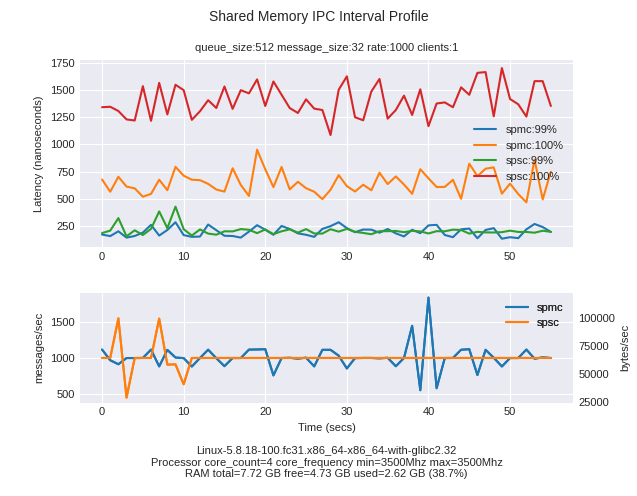

# `Olive`

The Olive library provides tools which implement inter-process communication between a producer process and one or more consumers on a single machine using named shared memory. On fast paths, synchronisation utilises lock-free atomic algorithms. The relevant tools in Olive are prefixed with **SPMC** (single producer/multiple consumers).

The goal of the project is to enable a producer process to send messages, with a zero message drop guarantee, to one or more consumers while holding latencies as low as possible and to support high throughput.

An example use case for this software could be distributing data between micro services.

A second implementation of communication over shared memory is implemented using **boost::lockfree::spsc_queue** (**SPSC**) code to provide a baseline comparison for the SPMC code.

To build, unit test and generate performance test data see [build and test the Olive binaries](./README-build-test.md).

---

## `Performance plots`

### `Generate sample performance data`
Using the script *run_performance_tests.py* a range of performance test data can be generated.

Generate performance data for the SPMC implementation. This invocation assumes the server being invoked makes use of *Profile Guided Optimisation* available on Linux via the command line option *--server_pgo*. See [PGO](./README-build-test.md) section for more information.

Here we generate data for a range of queue sizes, throughput rates and client counts.

```
scripts/run_performance_tests.py --tool_type spmc --timeout 60 --server_cpu 1 --server_queue_size_list 512 65536 1048576 --server_message_size 32 --server_rate_list 1000 max  --client_stats latency throughput interval --client_directory ~/data/spmc/v1 --memory_name smem --client_count_list 1 2 --client_cpu_list 2 3 --server_pgo
```

Comparison performance data is generated using a *boost::lockfree::spsc_queue* based implementation.

```
scripts/run_performance_tests.py --tool_type spsc --timeout 60 --server_cpu 1 --server_queue_size_list 512 65536 1048576 --server_message_size 32 --server_rate_list 1000 max  --client_stats latency throughput interval --client_directory ~/data/spsc/v1 --memory_name smem --client_count_list 1 2 --client_cpu_list 2 3 --server_pgo
```
---
### `Plot performance data`
Having generated performance data, one can compare throughput and latency information for different performance test configurations by using the plotting scripts ***plot_latency_intervals.py*** and ***plot_latency_summary.py***

Example plotting latency and throughput data for olive and boost implementations

```
./scripts/plot_latency_intervals.py --client_directories ~/data/spmc/v1 ~/data/spsc/v1 --server_queue_sizes 512 --server_message_sizes 32 --server_rates 1000 --client_latency_percentiles 100 99 --title "Latency Profile"  --client_directory_descriptions spmc spsc --client_counts 1 --show_throughput

scripts/plot_latency_summary.py --server_queue_sizes 512 --server_message_sizes 32 --server_rates 1000 --client_counts 1 2 --client_directories ~/data/spmc/v1 ~/data/spsc/v1 --client_directory_descriptions spmc spsc --show_throughput
```

#### `Using a smaller queue size`

Using smaller queue sizes is beneficial for generating lower latencies. Conversely, maximum throughput values are reduced when working with smaller queues.

The plot below was generated using a throughput limited to 1000 msgs/sec. Both the SPMC and SPSC implementations exhibit lower latency values for smaller queue sizes.

Maximum latency values for the SPMC implementation are lower than the equivalent values for the SPSC design. However, the throughput graph for SPMC is less smooth than SPSC. This is due to the SPMC data being consumed in batches.



When testing at maximum throughput, the SPMC implementation continues to exhibit lower latencies as well as a much higher throughput than the SPSC implementation.


**Performance Summaries**

The performance summaries below show the full latency profile using a log scale to more easily visualise the data.

At a lower throughput rate, the SPMC implementation demonstrates similar latency profile to SPSC up to around 90%. Above 90% the SPMC implementation exhibits a better latency profile.


Maximum throughput is much higher and latency is lower for the SPMC implementation than for SPSC.


#### `Using a larger queue size`

When limited to a low throughput, the SPMC implementation displays a lower maximum latency than the SPSC implementation. However, the 99th pecentiles are largely similar for both implementations.


Using larger queues for the SPMC implementation results in a bias towards throughput at the expense of increased latency values.


**Performance Summaries**

The performance summaries below show the full latency profile using a log scale.

Limiting throughput to 1000 messages/second.


When throughput is not limited, the SPMC implementation has a much higher throughput than equivalent SPSC configuration. Latency is also generally higher, due to the batching behaviour of the SPMC code.


