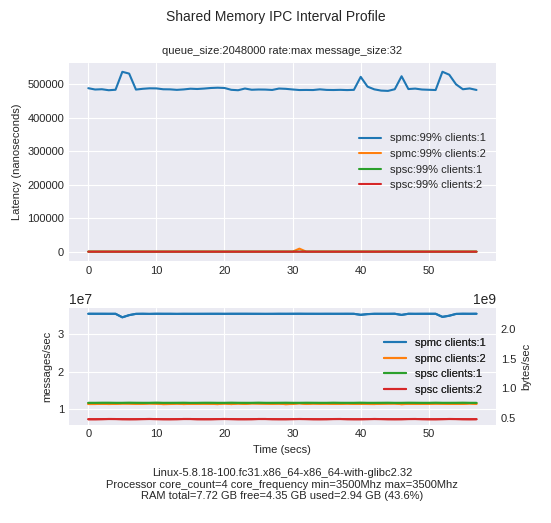

# `Olive`

The Olive library implements inter-process communication between a producer process and multiple consumers on a single machine over named shared memory. The relevant tools are prefixed by SPMC (single producer/multiple consumers).

The goal of the project is to send the messages with a zero message drop guarantee while holding latencies as low as possible and to support high throughput. An example use case might be for distributing market data from a stock exchange.

An implementation of *boost::lockfree::spsc_queue* (SPSC) communicating over shared memory is implemented to provide a performance comparision.

To build, unit test and generate performance test data see [build and test the Olive binaries](./README-build-test.md).

---

## Performance plots

Having generated performance data, the following plots illustrate latency and throughput performance for SPMC and SPSC implementations.

### Small queue size
Smaller queue sizes exhibit lower latency values for lower throughputs but also lower maximum throughputs.

### Larger queue size
The SPMC behaviour for larger queues is to prioritise throughput at the expence of latencies.

